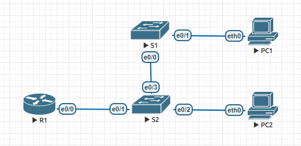

# Lab 01. VLAN / Router-on-Stick

> Настроить маршрутизацию в сети между разными VLAN'ами

## План работы

1. Соберём простой стенд с двумя парами свичей и ПК в разных VLAN'ах, добавим роутер для маршрутизации между VLAN'ами
2. Сконфигурируем свичи и ПК
3. Проверим, что пакеты не маршрутизируются между ПК в разных VLAN'ах
4. Сконфигурируем маршрутизацию
5. Проверим, что теперь пакеты маршрутизируются

## Сборка стенда

### Топология



### Таблица устройств и подключений

Устройство | Интерфейс | Подключение | VLAN | IP адрес
--- | --- | --- | --- | ---
S1 | e0/0 | S2 (trunk) | - | 192.168.2.2
   | e0/1 | PC1 | VLAN 2 | 
S2 | e0/0 | S1 (trunk) | - | 192.168.3.2
   | e0/1 | PC2 | VLAN 3 | 
   | e0/2 | R1 (trunk) | - |
R1 | e0/0.1 | S2 (trunk) | VLAN 2 | 192.168.2.1
   | e0/0.2 | S2 (trunk) | VLAN 3 | 192.168.3.1
   | e0/0.2 | S2 (trunk) | VLAN 4 (native) | 192.168.3.1
PC1 | eth0 | S1 | - | 192.168.2.3
PC2 | eth0 | S2 | - | 192.168.3.3

### Предварительная настройка устройств

<details>
  <summary>PC1</summary>
  
  ```shell
  ip 192.168.2.3 192.168.2.1 24
  ```
</details>

<details>
  <summary>PC2</summary>
  
  ```shell
  ip 192.168.3.3 192.168.3.1 24
  ```
</details>

<details>
  <summary>S1</summary>
  
  ```
  enable
  
  configure terminal
    hostname S1
    no ip domain-lookup

    interface e0/0
      description Trunk

      switchport trunk encapsulation dot1q
      switchport trunk allowed vlan 2,3,4
      switchport trunk native vlan 4
      switchport mode trunk
      switchport nonegotiate

      no shutdown
    exit

    interface e0/1
      description PC1 Access

      switchport mode access
      switchport access vlan 2

      no shutdown
    exit

    interface vlan 2
      ip address 192.168.2.2 255.255.255.0
    exit
    
    ip default-gateway 192.168.2.1
  exit

  copy running-config startup-config
  ```
</details>

<details>
  <summary>S2</summary>
  
  ```
  enable
  
  configure terminal
    hostname S2
    no ip domain-lookup

    interface e0/3
      description Trunk (S1)

      switchport trunk encapsulation dot1q
      switchport trunk allowed vlan 2,3,4
      switchport trunk native vlan 4
      switchport mode trunk
      switchport nonegotiate
      
      no shutdown
    exit

    interface e0/1
      description Trunk (R1)

      switchport trunk encapsulation dot1q
      switchport trunk allowed vlan 2,3,4
      switchport trunk native vlan 4
      switchport mode trunk
      switchport nonegotiate
      
      no shutdown
    exit

    interface e0/2
      description PC2 Access

      switchport mode access
      switchport access vlan 3

      no shutdown
    exit

    interface vlan 3
      ip address 192.168.3.2 255.255.255.0
    exit
    
    ip default-gateway 192.168.3.1
  exit

  copy running-config startup-config
  ```
</details>

### Проверка немаршрутизируемости ПК в разных VLAN

```
PC1> ping 192.168.2.3

192.168.2.3 icmp_seq=1 ttl=64 time=0.001 ms
192.168.2.3 icmp_seq=2 ttl=64 time=0.001 ms
192.168.2.3 icmp_seq=3 ttl=64 time=0.001 ms
192.168.2.3 icmp_seq=4 ttl=64 time=0.001 ms
192.168.2.3 icmp_seq=5 ttl=64 time=0.001 ms

PC1> ping 192.168.3.3

host (192.168.2.1) not reachable
```

```
PC2> ping 192.168.3.3

192.168.3.3 icmp_seq=1 ttl=64 time=0.001 ms
192.168.3.3 icmp_seq=2 ttl=64 time=0.001 ms
192.168.3.3 icmp_seq=3 ttl=64 time=0.001 ms
192.168.3.3 icmp_seq=4 ttl=64 time=0.001 ms
192.168.3.3 icmp_seq=5 ttl=64 time=0.001 ms

PC2> ping 192.168.2.3

host (192.168.3.1) not reachable
```

Пакеты не маршрутизируются, потому-что R1 не настроен, а именно он выбран как gateway на ПК.

### Настройка роутера

<details>
  <summary>R1</summary>
  
  ```
  enable

  configure terminal
    hostname R1
    no ip domain-lookup

    interface e0/0
      description Trunk

      no ip address
      no shutdown
    exit

    interface e0/0.2
      description Gateway for VLAN 2

      encapsulation dot1Q 2
      ip address 192.168.2.1 255.255.255.0

      no shutdown
    exit

    interface e0/0.3
      description Gateway for VLAN 3

      encapsulation dot1Q 3
      ip address 192.168.3.1 255.255.255.0
      
      no shutdown
    exit

    interface e0/0.4
      description Native VLAN
      
      no ip address
      encapsulation dot1Q 4 native
      
      no shutdown
    exit
  exit

  copy running-config startup-config
  ```
</details>

### Проверка маршрутизации пакетов между VLAN

<details>
  <summary>Проверим, что пакеты доходят до маршрутизатора</summary>
  
  ```
  PC1> ping 192.168.2.1

  84 bytes from 192.168.2.1 icmp_seq=1 ttl=255 time=0.535 ms
  84 bytes from 192.168.2.1 icmp_seq=2 ttl=255 time=0.667 ms
  84 bytes from 192.168.2.1 icmp_seq=3 ttl=255 time=0.678 ms
  84 bytes from 192.168.2.1 icmp_seq=4 ttl=255 time=0.717 ms
  84 bytes from 192.168.2.1 icmp_seq=5 ttl=255 time=0.423 ms

  PC1> ping 192.168.3.1

  84 bytes from 192.168.3.1 icmp_seq=1 ttl=255 time=1.097 ms
  84 bytes from 192.168.3.1 icmp_seq=2 ttl=255 time=0.804 ms
  84 bytes from 192.168.3.1 icmp_seq=3 ttl=255 time=0.636 ms
  84 bytes from 192.168.3.1 icmp_seq=4 ttl=255 time=0.428 ms
  84 bytes from 192.168.3.1 icmp_seq=5 ttl=255 time=0.558 ms

  PC2> ping 192.168.2.1

  84 bytes from 192.168.2.1 icmp_seq=1 ttl=255 time=0.623 ms
  84 bytes from 192.168.2.1 icmp_seq=2 ttl=255 time=0.488 ms
  84 bytes from 192.168.2.1 icmp_seq=3 ttl=255 time=0.558 ms
  84 bytes from 192.168.2.1 icmp_seq=4 ttl=255 time=0.929 ms
  84 bytes from 192.168.2.1 icmp_seq=5 ttl=255 time=0.689 ms

  PC2> ping 192.168.3.1

  84 bytes from 192.168.3.1 icmp_seq=1 ttl=255 time=0.544 ms
  84 bytes from 192.168.3.1 icmp_seq=2 ttl=255 time=0.809 ms
  84 bytes from 192.168.3.1 icmp_seq=3 ttl=255 time=0.576 ms
  84 bytes from 192.168.3.1 icmp_seq=4 ttl=255 time=0.451 ms
  84 bytes from 192.168.3.1 icmp_seq=5 ttl=255 time=0.572 ms
  ```
</details>

<details>
  <summary>Проверим, что пакеты маршрутизируются между ПК</summary>
  
  ```
  PC1> ping 192.168.3.3

  84 bytes from 192.168.3.3 icmp_seq=1 ttl=255 time=0.555 ms
  84 bytes from 192.168.3.3 icmp_seq=2 ttl=255 time=0.580 ms
  84 bytes from 192.168.3.3 icmp_seq=3 ttl=255 time=1.139 ms
  84 bytes from 192.168.3.3 icmp_seq=4 ttl=255 time=0.629 ms
  84 bytes from 192.168.3.3 icmp_seq=5 ttl=255 time=0.552 ms

  PC2> ping 192.168.2.3

  84 bytes from 192.168.2.3 icmp_seq=1 ttl=255 time=1.070 ms
  84 bytes from 192.168.2.3 icmp_seq=2 ttl=255 time=0.475 ms
  84 bytes from 192.168.2.3 icmp_seq=3 ttl=255 time=0.529 ms
  84 bytes from 192.168.2.3 icmp_seq=4 ttl=255 time=0.612 ms
  84 bytes from 192.168.2.3 icmp_seq=5 ttl=255 time=0.487 ms
  ```
</details>

<details>
  <summary>Проверим, что происходит, если попробовать достучаться до несуществующего хоста</summary>
  
  ```
  VPCS> ping 192.168.2.4

  192.168.2.4 icmp_seq=1 timeout
  192.168.2.4 icmp_seq=2 timeout
  192.168.2.4 icmp_seq=3 timeout
  192.168.2.4 icmp_seq=4 timeout
  192.168.2.4 icmp_seq=5 timeout
  ```
</details>

### Выводы

Router-on-Stick простой способ добавить маршрутизацию в L2-сеть, который требует минимальной настройки