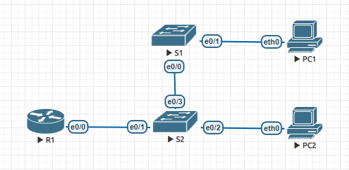

# Lab 02. Избыточность локальных сетей. STP

> Настройка STP и наблюдение за процессом работы протокола

## Задание

> Создать сеть, настроить коммутаторы, STP, проследить за процессом выбора порта исходя из стоимости, проследить за процессом выбора порта исходя из приоритета

## Сборка стенда

Для начала воссоздадим стенд в соответствии с топологией,
предложенной в задании:



## Назначение адресов

Каждому устройству назначим ip-адрес в соответствии с его номером:

|Устройство|IP|VLAN|
|S1|192.168.0.1/24|100|
|S2|192.168.0.2/24|100|
|S3|192.168.0.3/24|100|

## Настройка устройств

Проведём базовую настройку устройств:

<details>
  <summary>Базовая настройка</summary>

  ```
  no ip domain-lookup
  hostname {S1,S2,S3}
  enable secret {secret}

  line console 0
    password {pass}
    login
  end

  line vty 0 15
    password {pass}
    login
  end

  service password-encryption
  line con 0
  logging synchronous
  banner motd #Warning! Authorized access only!#

  copy running-config startup-config

  interface vlan 100
    ip add 192.168.0.{device} 255.255.255.0
    no shutdown
  exit
  ```
</details>

<details>
  <summary>Проверим работоспособность конфигурации</summary>

  ```
  S1# ping 192.168.1.2
  ...
  Success rate is 100 percent (5/5), round-trip min/avg/max = 1/1/1 ms
  ```

  ```
  S1# ping 192.168.1.3
  ...
  Success rate is 100 percent (5/5), round-trip min/avg/max = 1/1/1 ms
  ```

  ```
  S2# ping 192.168.1.1
  ...
  Success rate is 100 percent (5/5), round-trip min/avg/max = 1/1/1 ms
  ```

  ```
  S2# ping 192.168.1.3
  ...
  Success rate is 100 percent (5/5), round-trip min/avg/max = 1/1/1 ms
  ```

  ```
  S3# ping 192.168.1.1
  ...
  Success rate is 100 percent (5/5), round-trip min/avg/max = 1/1/1 ms
  ```

  ```
  S3# ping 192.168.1.2
  ...
  Success rate is 100 percent (5/5), round-trip min/avg/max = 1/1/1 ms
  ```
</details>

Настроим транки на всех портах:

<details>
  <summary>Проверим работоспособность конфигурации</summary>

  ```
  interface range e0/0-3
    switchport trunk encapsulation dot1q
    switchport mode trunk
  exit
  ```
</details>

## Наблюдаем за работой STP

Сначала посмотрим за процессом выбора Root Bridge.

<details>
  <summary>Включаем порты e0/0 и e0/2</summary>

  ```
  interface e0/0
    no shutdown
  interface e0/2
    no shutdown
  exit
  ```
</details>

<details>
  <summary>Проверяем работу STP</summary>

  ```
  S1# show spanning-tree

  VLAN0100
    Spanning tree enabled protocol ieee
    Root ID    Priority    32769
               Address     aabb.cc00.1000
               This bridge is the root
               Hello time   2 sec  Max Age 20 sec  Forward Delay 15 sec

    Bridge ID  Priority    32769  (priority 32768 sys-id-ext 1)
               Address     aabb.cc00.1000
               Hello time   2 sec Max Age 20 sec  Forward Delay 15 sec
               Aging time  15 sec

    Interface           Role Sts Costs     Prio.Nbr Type
    ------------------- ---- --- --------- -------- --------------------------
    Eth0/0              Desg FWD 100       128.1    Shr
    Eth0/2              Desg FWD 100       128.3    Shr
  ```

  ```
  S2# show spanning-tree

  VLAN0100
    Spanning tree enabled protocol ieee
    Root ID    Priority    32769
               Address     aabb.cc00.1000
               Cost        100
               Port        3 (Ethernet0/2)
               Hello time   2 sec  Max Age 20 sec  Forward Delay 15 sec

    Bridge ID  Priority    32769  (priority 32768 sys-id-ext 1)
               Address     aabb.cc00.2000
               Hello time   2 sec Max Age 20 sec  Forward Delay 15 sec
               Aging time  300 sec

    Interface           Role Sts Costs     Prio.Nbr Type
    ------------------- ---- --- --------- -------- --------------------------
    Eth0/0              Desg FWD 100       128.1    Shr
    Eth0/2              Root FWD 100       128.3    Shr
  ```

  ```
  S3# show spanning-tree

  VLAN0100
    Spanning tree enabled protocol ieee
    Root ID    Priority    32769
               Address     aabb.cc00.1000
               Cost        100
               Port        1 (Ethernet0/0)
               Hello time   2 sec  Max Age 20 sec  Forward Delay 15 sec

    Bridge ID  Priority    32769  (priority 32768 sys-id-ext 1)
               Address     aabb.cc00.3000
               Hello time   2 sec Max Age 20 sec  Forward Delay 15 sec
               Aging time  300 sec

    Interface           Role Sts Costs     Prio.Nbr Type
    ------------------- ---- --- --------- -------- --------------------------
    Eth0/0              Root FWD 100       128.1    Shr
    Eth0/2              Altn BLK 100       128.3    Shr
  ```
</details>

`S1` был выбран как Root Bridge, т.к. у него наименьший MAC-адрес из всех
устройств сети (`aabb.cc00.1000`).

Порты были размечены как:

- Designated: `e0/0`, `e0/2` `S1`, `e0/2` `S2` и `e0/0` `S3` (смотрят на Root Bridge)
- Alternate: `e0/2` `S3`, т.к. у него и `e0/0` одинаковая стоимость, а Bridge ID `S3` меньше, чем Bridge ID `S2`

### Выбор портов исходя из стоимости

Теперь посмотрим на работу STP при изменении приоритетов портов:

<details>
  <summary>Изменим стоимость порта</summary>

  Уменьшим стоимость порта `e0/0` на `S3`,
  чтобы посмотреть на то, как изменится выбор Designated порта:

  ```
  interface e0/0
    spa
    spaninng-tree cost 90
  exit
  ```
</details>

<details>
  <summary>Проверяем работу STP</summary>

  ```
  S2# show spanning-tree

  VLAN0100
    Spanning tree enabled protocol ieee
    Root ID    Priority    32769
               Address     aabb.cc00.1000
               Cost        100
               Port        3 (Ethernet0/2)
               Hello time   2 sec  Max Age 20 sec  Forward Delay 15 sec

    Bridge ID  Priority    32769  (priority 32768 sys-id-ext 1)
               Address     aabb.cc00.2000
               Hello time   2 sec Max Age 20 sec  Forward Delay 15 sec
               Aging time  300 sec

    Interface           Role Sts Costs     Prio.Nbr Type
    ------------------- ---- --- --------- -------- --------------------------
    Eth0/0              Altn BLK 100       128.1    Shr
    Eth0/2              Root FWD 100       128.3    Shr
  ```

  ```
  S3# show spanning-tree

  VLAN0100
    Spanning tree enabled protocol ieee
    Root ID    Priority    32769
               Address     aabb.cc00.1000
               Cost        100
               Port        1 (Ethernet0/0)
               Hello time   2 sec  Max Age 20 sec  Forward Delay 15 sec

    Bridge ID  Priority    32769  (priority 32768 sys-id-ext 1)
               Address     aabb.cc00.3000
               Hello time   2 sec Max Age 20 sec  Forward Delay 15 sec
               Aging time  300 sec

    Interface           Role Sts Costs     Prio.Nbr Type
    ------------------- ---- --- --------- -------- --------------------------
    Eth0/0              Root FWD 100       128.1    Shr
    Eth0/2              Desg LIS 100       128.3    Shr
  ```
</details>

Как мы видим, теперь Designated портом стал `e0/2` `S3`.

<details>
  <summary>Отменяем изменение стоимости</summary>

  ```
  interface e0/0
    no spa
    no spaninng-tree cost 90
  exit
  ```
</details>

### Выбор портов исходя из приоритетов

Для портов, у которых стоимости равны, порт выбирается исходя из
Bridge ID. Если Bridge ID равны — используются приоритеты портов.

В таком случае выбирается порт с наиболее низким приоритетом.

Проверим, как будет работать STP, если мы включим все порты:

<details>
  <summary>Включаем порты</summary>

  На всех устройствах:

  ```
  interface e0/0-3
    no shutdown
  exit
  ```
</details>

<details>
  <summary>Проверяем работу STP</summary>

  ```
  S1# show spanning-tree

  VLAN0100
    Spanning tree enabled protocol ieee
    Root ID    Priority    32769
               Address     aabb.cc00.1000
               This bridge is the root
               Hello time   2 sec  Max Age 20 sec  Forward Delay 15 sec

    Bridge ID  Priority    32769  (priority 32768 sys-id-ext 1)
               Address     aabb.cc00.1000
               Hello time   2 sec Max Age 20 sec  Forward Delay 15 sec
               Aging time  300 sec

    Interface           Role Sts Costs     Prio.Nbr Type
    ------------------- ---- --- --------- -------- --------------------------
    Eth0/0              Desg FWD 100       128.1    Shr
    Eth0/1              Desg FWD 100       128.2    Shr
    Eth0/2              Desg FWD 100       128.3    Shr
    Eth0/3              Desg FWD 100       128.4    Shr
  ```

  ```
  S2# show spanning-tree

  VLAN0100
    Spanning tree enabled protocol ieee
    Root ID    Priority    32769
               Address     aabb.cc00.1000
               Cost        100
               Port        2 (Ethernet0/1)
               Hello time   2 sec  Max Age 20 sec  Forward Delay 15 sec

    Bridge ID  Priority    32769  (priority 32768 sys-id-ext 1)
               Address     aabb.cc00.2000
               Hello time   2 sec Max Age 20 sec  Forward Delay 15 sec
               Aging time  300 sec

    Interface           Role Sts Costs     Prio.Nbr Type
    ------------------- ---- --- --------- -------- --------------------------
    Eth0/0              Desg FWD 100       128.1    Shr
    Eth0/1              Root FWD 100       128.2    Shr
    Eth0/2              Altn BLK 100       128.3    Shr
    Eth0/3              Desg FWD 100       128.4    Shr
  ```

  ```
  S3# show spanning-tree

  VLAN0100
    Spanning tree enabled protocol ieee
    Root ID    Priority    32769
               Address     aabb.cc00.1000
               Cost        100
               Port        1 (Ethernet0/0)
               Hello time   2 sec  Max Age 20 sec  Forward Delay 15 sec

    Bridge ID  Priority    32769  (priority 32768 sys-id-ext 1)
               Address     aabb.cc00.3000
               Hello time   2 sec Max Age 20 sec  Forward Delay 15 sec
               Aging time  300 sec

    Interface           Role Sts Costs     Prio.Nbr Type
    ------------------- ---- --- --------- -------- --------------------------
    Eth0/0              Root FWD 100       128.1    Shr
    Eth0/1              Altn BLK 100       128.2    Shr
    Eth0/2              Altn BLK 100       128.3    Shr
    Eth0/3              Altn BLK 100       128.4    Shr
  ```
</details>

Теперь порт `e0/1` `S2` и `e0/0` `S3` стали Root, т.к. они имеют наименьший номер порта относительно
смотрящих на Root Switch.

## Выводы

В процессе работы мы протестировали протокол STP и проследили за тем,
как при этом в различных конфигурациях строятся маршруты,
на основе стоимостей, Bridge ID и приоритетов.
