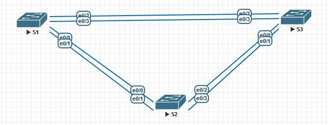

# Lab 02. Избыточность локальных сетей. STP

> Настройка STP и наблюдение за процессом работы протокола

## Задание

> Создать сеть, настроить коммутаторы, STP, проследить за процессом выбора порта исходя из стоимости, проследить за процессом выбора порта исходя из приоритета

## Сборка стенда

Для начала воссоздадим стенд в соответствии с топологией,
предложенной в задании:



## Настройка устройств

Проведём базовую настройку устройств:

<details>
  <summary>S1</summary>

  ```
  TODO
  ```
</details>

<details>
  <summary>S2</summary>

  ```
  TODO
  ```
</details>

<details>
  <summary>S3</summary>

  ```
  TODO
  ```
</details>

<details>
  <summary>Проверим работоспособность конфигурации</summary>

  ```
  TODO: ping
  ```
</details>

## Наблюдаем за работой STP

Сначала посмотрим за процессом выбора Root Bridge.

<details>
  <summary>Включаем порты TODO</summary>

  ```
  TODO
  ```
</details>

<details>
  <summary>Проверяем работу STP</summary>

  S1:
  ```
  show spanning-tree

  TODO
  ```

  S2:
  ```
  show spanning-tree

  TODO
  ```

  S3:
  ```
  show spanning-tree

  TODO
  ```
</details>

TODO: выводы (почему выбрался S1),
TODO: куда были назнначены Designated, Alternate

### Выбор портов исходя из стоимости

Теперь посмотрим на работу STP при изменении приоритетов портов:

<details>
  <summary>Изменим стоимость порта</summary>

  ```
  TODO: int
  spa
  spaninng-tree cost 90
  exit
  ```
</details>

TODO: описать изменение путей

<details>
  <summary>Проверяем работу STP</summary>

  S1:
  ```
  show spanning-tree

  TODO
  ```

  S2:
  ```
  show spanning-tree

  TODO
  ```

  S3:
  ```
  show spanning-tree

  TODO
  ```
</details>

TODO: отменяем изменение стоимости

### Выбор портов исходя из приоритетов

Для портов, у которых стоимости равны, порт выбирается исходя из
Bridge ID. Если Bridge ID равны — используются приоритеты портов.

В таком случае выбирается порт с наиболее низким приоритетом.

<details>
  <summary>Включаем порты TODO</summary>

  ```
  TODO
  ```
</details>

<details>
  <summary>Проверяем работу STP</summary>

  S1:
  ```
  show spanning-tree

  TODO
  ```

  S2:
  ```
  show spanning-tree

  TODO
  ```

  S3:
  ```
  show spanning-tree

  TODO
  ```
</details>

TODO: выводы (кто стал Root)

## Выводы

В процессе работы мы протестировали протокол STP и проследили за тем,
как при этом в различных конфигурациях строятся маршруты,
на основе стоимостей, Bridge ID и приоритетов.
