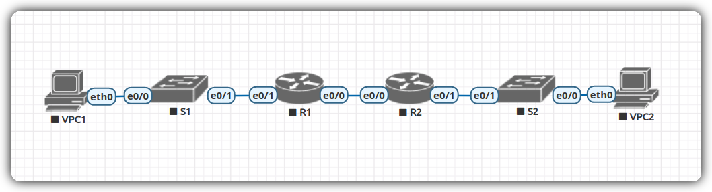

# Lab 03. DHCPv4/v6 и SLAAC

> Настройка DHCP для IPv4 и IPv6

## Задание

- Настроить DHCPv4
  1. Собрать стенд и провести базовую настройку устройств
  2. Настроить и проверить два DHCPv4 сервера на R1
  3. Настроить и проверить DHCP реле на R2

- Настроить DHCPv6
  1. Собрать стенд и провести базовую настройку устройств
  2. Проверить раздачу SLAAC адресов с R1
  3. Настроить и проверить Stateless DHCPv6 сервер на R1
  4. Настроить и проверить Stateful DHCPv6 сервер на R1
  5. Настроить и проверить DHCPv6 реле на R2

## DHCPv4

### Сборка стенда

Для начала воссоздадим стенд в соответствии с топологией,
предложенной в задании:



Таблица адресов:

|Device|   Interface | IP Address   |   Subnet Mask    |Default Gateway|
|------|-------------|--------------|------------------|---------------|
| R1   |  e0/0       | 10.0.0.1     | 255.255.255.252  |  N/A          |
| R1   |  e0/1       | N/A          | N/A              |  N/A          |
| R1   |  e0/1.100   | 192.168.1.1  | 255.255.255.192  |  N/A          |
| R1   |  e0/1.200   | 192.168.1.65 | 255.255.255.224  |  N/A          |
| R1   |  e0/1.1000  | N/A          | N/A              |  N/A          |
| R2   |  e0/0       | 10.0.0.2     | 255.255.255.252  |  N/A          |
| R2   |  e0/1       | 192.168.1.97 | 255.255.255.240  |  N/A          |
| S1   |  VLAN 200   | 192.168.1.66 | 255.255.255.224  |  192.168.1.65 |
| S2   |  VLAN 1     | 192.168.1.98 | 255.255.255.240  |  192.168.1.97 |
| VPC1 |  NIC        | DHCP         | DHCP             |  DHCP         |
| VPC2 |  NIC        | DHCP         | DHCP             |  DHCP         |

Таблица VLAN:

|  VLAN  |  Name         |  Interface Assigned  |
|--------|---------------|----------------------|
|  1     |  N/A          |  S2: Et0/1           |
|  100   |  Clients      |  S1: Et0/3           |
|  200   |  Management   |  S1: VLAN 200        |
|  999   |  Parking_Lot  |  S1: Et0/1, Et0/2    |
|  1000  |  Native       |  N/A                 |

### Настройка устройств

Проведём базовую настройку устройств:

<details>
  <summary>Для маршрутизаторов</summary>

  ```
  enable

  configure terminal
    hostname <HOSTNAME>
    no ip domain lookup
    enable secret <SECRET>
    line console 0
      password <PASSWORD>
      login
    exit

    line vty 0 4
      password <PASSWORD>
      login
    exit

    service password-encryption
    banner motd #Authorized Access Only!#
  end

  copy running-config startup-config
  ```
</details>

<details>
  <summary>Для коммутаторов</summary>

  ```
  enable

  configure terminal
    hostname <HOST>
    no ip domain lookup
    enable secret <SECRET>

    line console 0
      password <PASSWORD>
      login
    exit

    line vty 0 4
      password <PASSWORD>
      login
    exit

    service password-encryption
    banner motd #Authorized Access Only!#
  end

  copy running-config startup-config
  ```
</details>

<details>
  <summary>Для VPCs</summary>

  Настройка не требуется, получение адреса по DHCP
  мы будем выполнять впоследствии вручную.
</details>

Настроим также маршрутизацию внутри сети и между VLAN'ами.
Для этого сначала определимся с адресами:

Выделим 3 подсети из `192.168.1.0/24`:

1. A — вмещающая 58 (≤64) хостов: `192.168.1.0/26`
2. B — вмещающая 28 (≤32) хостов: `192.168.1.64/27`
3. C — вмещающая 12 (≤16) хостов: `192.168.1.96/28`

Настроим интерфейсы:

`R1`:

```
interface Ethernet0/0
  ip address 10.0.0.1 255.255.255.252
  no shutdown

interface Ethernet0/1
  no shutdown

interface Ethernet0/1.100
  encapsulation dot1q 100
  ip address 192.168.1.1 255.255.255.192
  no shutdown

interface Ethernet0/1.200
  encapsulation dot1q 200
  ip address 192.168.1.65 255.255.255.224
  no shutdown

interface Ethernet0/1.1000
  encapsulation dot1q 1000
  no shutdown
```

`R2`:

```
interface Ethernet0/0
  ip address 10.0.0.2 255.255.255.252
  no shutdown

interface Ethernet0/1
  ip address 192.168.1.97 255.255.255.240
  no shutdown
```

`S1`:

```
vlan 100
  name Clients

vlan 999
  name ParkingOfLot

interface range Ethernet0/0, Ethernet0/2
  switchport mode access
  switchport access vlan 999

interface Ethernet0/3
  switchport mode acces
  switchport acces vlan 100

interface Ethernet0/1
  switchport trunk encapsulation dot1q
  switchport mode trunk
  switchport trunk native vlan 1000
  switchport trunk allowed vlan 100,200,1000

interface Vlan200
  ip address 192.168.1.66 255.255.255.224
  no shutdown
```

`S2`:

```
vlan 1
  name Management

interface Ethernet0/3
  switchport mode access
  switchport access vlan 1

interface range Ethernet0/0, Ethernet0/2
  shutdown

interface Vlan1
  ip address 192.168.1.98 255.255.255.240
  no shutdown
```

Укажем статические маршруты на обоих роутерах:

```
ip route 0.0.0.0 0.0.0.0 <IP>
```

И шлюзы по-умолчанию на свичах:

```
ip default-gateway <GATEWAY>
```

Проверим работоспособность:

```
R1# ping 192.168.1.97
...
Success rate is 100 percent (5/5), round-trip min/avg/max = 1/1/1 ms
```

### Настройка DHCP серверов на R1

Настроим DHCP-пул:

```
ip dhcp excluded-address 192.168.1.1 192.168.1.5
ip dhcp excluded-address 192.168.1.65 192.168.1.69
ip dhcp excluded-address 192.168.1.97 192.168.1.101

ip dhcp pool Subnet A
  network 192.168.1.0 255.255.255.192
  default-router 192.168.1.1
  domain-name ccna-lab.com
  lease 2 12 30

ip dhcp pool Subnet B
  network 192.168.1.64 255.255.255.224
  default-router 192.168.1.65
  domain-name ccna-lab.com
  lease 2 12 30

ip dhcp pool Subnet C
  network 192.168.1.96 255.255.255.240
  default-router 192.168.1.97
  domain-name ccna-lab.com
  lease 2 12 30
```

Попробуем получить IP-адресс с `VPC1`:

```
# ip dhcp
DDORA IP 192.168.1.6/26 GW 192.168.1.1
```

И проверим сетевую доступность `R2` c `VCP1`:

```
ping 192.168.1.97

84 bytes from 192.168.1.97 icmp_seq=1 ttl=254 time=0.562 ms
84 bytes from 192.168.1.97 icmp_seq=2 ttl=254 time=0.564 ms
84 bytes from 192.168.1.97 icmp_seq=3 ttl=254 time=0.643 ms
84 bytes from 192.168.1.97 icmp_seq=4 ttl=254 time=0.753 ms
84 bytes from 192.168.1.97 icmp_seq=5 ttl=254 time=0.673 ms
```

### Настройка DHCP реле на R2

Теперь настроим пересылку DHCP-сообщений с `R1` через `R2`:

```
interface Ethernet0/1
  ip helper-address 10.0.0.1
```

Запросим IP-адресс с `VPC2`:

```
# ip dhcp
DDORA IP 192.168.1.102/28 GW 192.168.1.97
```

И, наконец, проверим сетевую доступность `R1` c `VCP2`:

```
ping 192.168.1.1

84 bytes from 192.168.1.1 icmp_seq=1 ttl=254 time=0.532 ms
84 bytes from 192.168.1.1 icmp_seq=2 ttl=254 time=0.854 ms
84 bytes from 192.168.1.1 icmp_seq=3 ttl=254 time=0.732 ms
84 bytes from 192.168.1.1 icmp_seq=4 ttl=254 time=0.842 ms
84 bytes from 192.168.1.1 icmp_seq=5 ttl=254 time=0.711 ms
```

## DHCPv6

### Сборка стенда

Для начала воссоздадим стенд в соответствии с топологией,
предложенной в задании.

Топология полностью аналогична оной в предыдущей части,
поэтому просто скопируем её:


### Таблица адресов

|Device|Interface|IPv6 Address|
|R1|Et0/0|2001:db8:acad:2::1/64|
|||fe80::1|
||Et0/1|2001:db8:acad:1::1/64|
|||fe80::1|
|R2|Et0/0|2001:db8:acad:2::2/64|
|||fe80::2|
||Et0/1|2001:db8:acad:3::1/64|
|||fe80::1|
|PC-A|Eth0|DHCP|
|PC-B|Eth0|DHCP|

### Настройка устройств

Настроим IPv6 маршрутизацию:

`R1`:

```
enable
configure terminal
  interface Ethernet0/0
    ipv6 address 2001:db8:acad:2::1/64
    ipv6 address fe80::1 link-local
    no shutdown

  interface Ethernet0/1
    ipv6 address 2001:db8:acad:1::1/64
    ipv6 address fe80::1 link-local
    no shutdown

  ipv6 unicast-routing
  ipv6 route ::/0 2001:db8:acad:2::2
```

`R2`:

```
enable
configure terminal
  interface Ethernet0/0
    ipv6 address 2001:db8:acad:2::2/64
    ipv6 address fe80::2 link-local
    no shutdown

  interface Ethernet0/1
    ipv6 address 2001:db8:acad:3::1/64
    ipv6 address fe80::1 link-local
    no shutdown

ipv6 unicast-routing
ipv6 route ::/0 2001:db8:acad:2::1
```

### Проверка назначения SLAAC адресов

Проверим, что VPC1 присваивается IPv6 адрес по SLAAC:

```
# ipconfig /all

FastEthernet0 Connection:(default port)

   Connection-specific DNS Suffix..:
   Physical Address................: 00E0.B0CC.2EC1
   Link-local IPv6 Address.........: FE80::2E0:B0FF:FECC:2EC1
   IPv6 Address....................: 2001:DB8:ACAD:1:2E0:B0FF:FECC:2EC1
   IPv4 Address....................: 0.0.0.0
   Subnet Mask.....................: 0.0.0.0
   Default Gateway.................: FE80::1
                                     0.0.0.0
   DHCP Servers....................: 0.0.0.0
   DHCPv6 IAID.....................:
   DHCPv6 Client DUID..............: 00-01-00-01-E2-25-BA-B9-00-E0-B0-CC-2E-C1
   DNS Servers.....................: ::
                                     0.0.0.0
```

### Настройка DHCP серверов

#### Stateless

Настроим stateless DHCPv6 сервер на `R1`:

```
ipv6 dhcp pool R1-STATELESS
  dns-server 2001:db8:acad::254
  domain-name STATELESS.com

interface Ethernet0/1
  ipv6 nd other-config-flag
  ipv6 dhcp server R1-STATELESS
```

Проверим, что по SLAAC, помимо адреса получается также IAID и суффикс:

```
# ipconfig /all

FastEthernet0 Connection:(default port)

   Connection-specific DNS Suffix..: STATELESS.com
   Physical Address................: 00E0.B0CC.2EC1
   Link-local IPv6 Address.........: FE80::2E0:B0FF:FECC:2EC1
   IPv6 Address....................: 2001:DB8:ACAD:1:2E0:B0FF:FECC:2EC1
   IPv4 Address....................: 0.0.0.0
   Subnet Mask.....................: 0.0.0.0
   Default Gateway.................: FE80::1
                                     0.0.0.0
   DHCP Servers....................: 0.0.0.0
   DHCPv6 IAID.....................: 2044494489
   DHCPv6 Client DUID..............: 00-01-00-01-E2-25-BA-B9-00-E0-B0-CC-2E-C1
   DNS Servers.....................: 2001:DB8:ACAD::254
                                     0.0.0.0
```

#### Stateful

Теперь настроим stateful сервер:

```
ipv6 dhcp pool R2-STATEFUL
  address prefix 2001:db8:acad:3:aaa::/80
  dns-server 2001:db8:acad::254
  domain-name STATEFUL.com

interface Ethernet0/0
  ipv6 dhcp server R2-STATEFUL
```

### Настройка DHCP реле на R2

```
interface Ethernet0/1
  ipv6 nd managed-config-flag
  ipv6 dhcp relay destination 2001:db8:acad:2::1 Ethernet0/0
```
