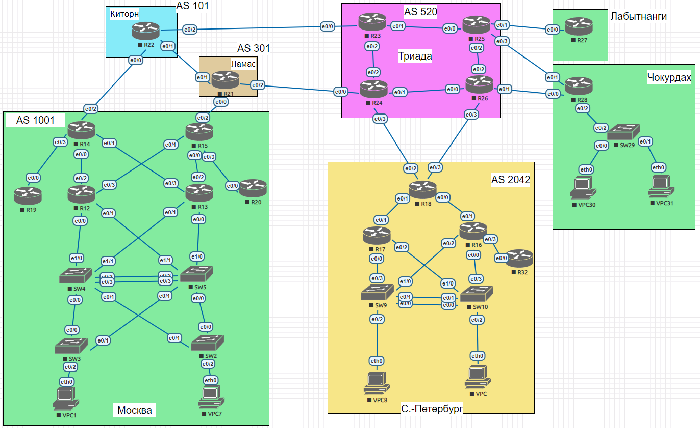

# Архитектура сети (планирование и адресного пространства, IPv4/6)

## Задание

**Цель:**

В данной самостоятельной работе необходимо распланировать адресное пространство
Настроить IP на всех активных портах для дальнейшей работы над проектом
Адресное пространство должно быть задокументировано

**Описание/Пошаговая инструкция выполнения домашнего задания:**

В этой самостоятельной работе мы ожидаем, что вы самостоятельно:

1. Разработаете и задокументируете адресное пространство для лабораторного стенда.
2. Настроите ip адреса на каждом активном порту
3. Настроите каждый VPC в каждом офисе в своем VLAN.
4. Настроите VLAN управления для сетевых устройств
5. Настроите сети офисов так, чтобы не возникало broadcast штормов, а использование линков было максимально оптимизировано

## Решение

Лабораторный стенд предоставлен в готовом виде, его топология:



Для решения задачи определим внутренние и внешние IPv4 и IPv6
подсети для каждой AS.

Для IPv4 все внутренние адреса будут из общей подсети `192.168.0.0/16`,
внешние — из `193.1.0.0/16`, а IPv6 — SLAAC адреса `2001::`

|AS|Город|IPv4 (внутр)|IPv4 (внеш)|IPv6|
|AS101 |Киторн      |`192.168.1.0/24`|`193.1.1.0/24`|`2001:1::/64`|
|AS301 |Ламас       |`192.168.2.0/24`|`193.1.2.0/24`|`2001:2::/64`|
|AS520 |Триада      |`192.168.3.0/24`|`193.1.3.0/24`|`2001:3::/64`|
|AS1001|Лабытананги |`192.168.4.0/24`|`193.1.4.0/24`|`2001:4::/64`|
|AS1001|Чокурдах    |`192.168.5.0/24`|`193.1.5.0/24`|`2001:5::/64`|
|AS1001|Москва      |`192.168.6.0/24`|`193.1.6.0/24`|`2001:6::/64`|
|AS2042|С.-Петербург|`192.168.7.0/24`|`193.1.7.0/24`|`2001:7::/64`|

В дальнейшем все устройства будут идти в том же порядке, что и
автономные системы в этой таблице, например все устройства
Московской AC, будут перед всеми устройствами Питерской.

Между собой устройства будут упорядочены по номеру.

Для каждого устройства в сети назначим адреса в соответствии с подсетями.

### Роутеры

|Устройство|Порт|Адрес (IPv4)|Адрес (IPv6)|
|R22|e0/0|`193.1.1.0`|`2001:1::0`|
|   |e0/1|`193.1.1.1`|`2001:1::1`|
|   |e0/2|`193.1.1.2`|`2001:1::2`|
|R21|e0/0|`193.1.2.0`|`2001:2::0`|
|   |e0/1|`193.1.2.1`|`2001:2::1`|
|   |e0/2|`193.1.2.2`|`2001:2::2`|
|R23|e0/0|`193.1.3.0` |`2001:3::0`|
|   |e0/1|`193.1.3.1` |`2001:3::1`|
|   |e0/2|`193.1.3.2` |`2001:3::2`|
|R24|e0/0|`193.1.3.10`|`2001:3::1:0`|
|   |e0/1|`193.1.3.11`|`2001:3::1:1`|
|   |e0/2|`193.1.3.12`|`2001:3::1:2`|
|   |e0/3|`193.1.3.13`|`2001:3::1:3`|
|R25|e0/0|`193.1.3.20`|`2001:3::2:0`|
|   |e0/1|`193.1.3.21`|`2001:3::2:1`|
|   |e0/2|`193.1.3.22`|`2001:3::2:2`|
|   |e0/3|`193.1.3.23`|`2001:3::2:3`|
|R26|e0/0|`193.1.3.30`|`2001:3::3:0`|
|   |e0/1|`193.1.3.31`|`2001:3::3:1`|
|   |e0/2|`193.1.3.32`|`2001:3::3:2`|
|   |e0/3|`193.1.3.33`|`2001:3::3:3`|
|R27|e0/0|`193.1.4.0`|`2001:4::0`|
|R28|e0/0|`193.1.5.0`|`2001:5::0`|
|   |e0/1|`193.1.5.1`|`2001:5::1`|
|   |e0/2|`193.1.5.2`|`2001:5::2`|
|R12|e0/0|`193.1.6.0`|`2001:6::0`|
|   |e0/1|`193.1.6.1`|`2001:6::1`|
|   |e0/2|`193.1.6.2`|`2001:6::2`|
|   |e0/3|`193.1.6.3`|`2001:6::3`|
|R13|e0/0|`193.1.6.10`|`2001:6::1:0`|
|   |e0/1|`193.1.6.11`|`2001:6::1:1`|
|   |e0/2|`193.1.6.12`|`2001:6::1:2`|
|   |e0/3|`193.1.6.13`|`2001:6::1:3`|
|R14|e0/0|`193.1.6.20`|`2001:6::2:0`|
|   |e0/1|`193.1.6.21`|`2001:6::2:1`|
|   |e0/2|`193.1.6.22`|`2001:6::2:2`|
|   |e0/3|`193.1.6.23`|`2001:6::2:3`|
|R15|e0/0|`193.1.6.30`|`2001:6::3:0`|
|   |e0/1|`193.1.6.31`|`2001:6::3:1`|
|   |e0/2|`193.1.6.32`|`2001:6::3:2`|
|   |e0/3|`193.1.6.33`|`2001:6::3:3`|
|R19|e0/0|`193.1.6.40`|`2001:6::4:0`|
|R20|e0/0|`193.1.6.50`|`2001:6::5:0`|
|R16|e0/0|`193.1.7.0`|`2001:7::0`|
|   |e0/1|`193.1.7.1`|`2001:7::1`|
|   |e0/2|`193.1.7.2`|`2001:7::2`|
|   |e0/3|`193.1.7.3`|`2001:7::3`|
|R17|e0/0|`193.1.7.10`|`2001:7::1:0`|
|   |e0/1|`193.1.7.11`|`2001:7::1:1`|
|   |e0/2|`193.1.7.12`|`2001:7::1:2`|
|R18|e0/0|`193.1.7.20`|`2001:7::2:0`|
|   |e0/1|`193.1.7.21`|`2001:7::2:1`|
|   |e0/2|`193.1.7.22`|`2001:7::2:2`|
|   |e0/3|`193.1.7.23`|`2001:7::2:3`|
|R32|e0/0|`193.1.7.30`|`2001:7::3:0`|

### Свичи

|Устройство|Порт|Адрес (IPv4)|Адрес (IPv6)|
|SW29|e0/0|`193.1.5.100`|`2001:5::1:0:0`|
|    |e0/1|`193.1.5.101`|`2001:5::1:0:1`|
|    |e0/2|`193.1.5.102`|`2001:5::1:0:2`|
|SW2|e0/0|`193.1.6.100`|`2001:6::1:0:0`|
|   |e0/1|`193.1.6.101`|`2001:6::1:0:1`|
|   |e0/2|`193.1.6.102`|`2001:6::1:0:2`|
|SW3|e0/0|`193.1.6.110`|`2001:6::1:1:0`|
|   |e0/1|`193.1.6.111`|`2001:6::1:1:1`|
|   |e0/2|`193.1.6.112`|`2001:6::1:1:2`|
|SW4|e0/0|`193.1.6.120`|`2001:6::1:2:0`|
|   |e0/1|`193.1.6.121`|`2001:6::1:2:1`|
|   |e0/2|`193.1.6.122`|`2001:6::1:2:2`|
|   |e0/3|`193.1.6.123`|`2001:6::1:2:3`|
|   |e1/0|`193.1.6.124`|`2001:6::1:2:4`|
|   |e1/1|`193.1.6.125`|`2001:6::1:2:5`|
|SW5|e0/0|`193.1.6.130`|`2001:6::1:3:0`|
|   |e0/1|`193.1.6.131`|`2001:6::1:3:1`|
|   |e0/2|`193.1.6.132`|`2001:6::1:3:2`|
|   |e0/3|`193.1.6.133`|`2001:6::1:3:3`|
|   |e1/0|`193.1.6.134`|`2001:6::1:3:4`|
|   |e1/1|`193.1.6.135`|`2001:6::1:3:5`|
|SW9 |e0/0|`193.1.7.100`|`2001:7::1:0:0`|
|    |e0/1|`193.1.7.101`|`2001:7::1:0:1`|
|    |e0/2|`193.1.7.102`|`2001:7::1:0:2`|
|    |e0/3|`193.1.7.103`|`2001:7::1:0:3`|
|SW10|e0/0|`193.1.7.110`|`2001:7::1:1:0`|
|    |e0/1|`193.1.7.111`|`2001:7::1:1:1`|
|    |e0/2|`193.1.7.112`|`2001:7::1:1:2`|
|    |e0/3|`193.1.7.113`|`2001:7::1:1:3`|

### VPCs

|Устройство|Адрес (IPv4)|Адрес (IPv6)|
|VPC30|`193.1.5.200`|`2001:5::2:0:0`|
|VPC31|`193.1.5.210`|`2001:5::2:1:0`|
|VPC1|`193.1.6.200`|`2001:6::2:0:0`|
|VPC7|`193.1.6.210`|`2001:6::2:1:0`|
|VPC  |`193.1.7.200`|`2001:7::2:0:0`|
|VPC8 |`193.1.7.210`|`2001:7::2:1:0`|

### Link-local адреса

Также назначим всем устройствам link-local IPv6 адреса,
по номеру устройства из `FE80::` подсети:

|Устройство|Link-local адрес (IPv6)|
|R22 |`FE80::22`|
|R21 |`FE80::21`|
|R23 |`FE80::23`|
|R24 |`FE80::24`|
|R25 |`FE80::25`|
|R26 |`FE80::26`|
|R27 |`FE80::27`|
|R28 |`FE80::28`|
|R12 |`FE80::12`|
|R13 |`FE80::13`|
|R14 |`FE80::14`|
|R15 |`FE80::15`|
|R19 |`FE80::19`|
|R20 |`FE80::20`|
|R16 |`FE80::16`|
|R17 |`FE80::17`|
|R18 |`FE80::18`|
|R32 |`FE80::32`|
|SW29|`FE80::29`|
|SW2 |`FE80::2`|
|SW3 |`FE80::3`|
|SW4 |`FE80::4`|
|SW5 |`FE80::5`|
|SW9 |`FE80::9`|
|SW10|`FE80::10`|

### VLAN

Теперь определимся с VLAN'ами.
Выделим для каждого VPC в каждом офисе свой VLAN,
настроим Management VLAN.

|VLAN|Устройство|Порт|
|100 (Management)|SW29|e0/3|
|                |SW2 |e0/3|
|                |SW3 |e0/3|
|                |SW4 |e1/2|
|                |SW5 |e1/2|
|                |SW9 |e1/0|
|                |SW10|e1/0|

|VLAN|Устройство|Порт|VPC|
|200|SW29|e0/0|VPC30
|300|    |e0/1|VPC31
|400|SW2 |e0/2|VPC1
|500|SW3 |e0/2|VPC7
|600|SW9 |e0/2|VPC8
|700|SW10|e0/2|VPC

### Конфигурация

Теперь проконфигурируем все устройства:

#### Роутеры

TODO

#### Свичи

<details>
  <summary>SW29</summary>

  ```
  version 15.2
  service timestamps debug datetime msec
  service timestamps log datetime msec
  no service password-encryption
  service compress-config
  !
  hostname SW29
  !
  boot-start-marker
  boot-end-marker
  !
  !
  !
  no aaa new-model
  clock timezone EET 2 0
  !
  !
  !
  !
  !
  !
  !
  !
  ip cef
  no ipv6 cef
  !
  !
  spanning-tree mode pvst
  spanning-tree extend system-id
  !
  vlan internal allocation policy ascending
  !
  vlan 200
  !
  vlan 300
  !
  vlan 100
  !
  !
  !
  !
  !
  !
  !
  !
  !
  !
  !
  interface Ethernet0/0
   no shutdown
   switchport access vlan 200
   switchport mode access
  !
  interface Ethernet0/1
   no shutdown
   switchport access vlan 300
   switchport mode access
  !
  interface Ethernet0/2
   no shutdown
   ip address 193.1.5.102
   ipv6 address 2001:5::1:0:2
   ipv6 address FE80::29 link-local
  !
  interface Vlan200
   no shutdown
   ip address 193.1.5.100
   ipv6 address 2001:5::1:0:0
   ipv6 address FE80::29 link-local
  !
  interface Vlan300
   no shutdown
   ip address 193.1.5.101
   ipv6 address 2001:5::1:0:1
   ipv6 address FE80::29 link-local
  !
  interface Vlan100
   no shutdown
  !
  ip forward-protocol nd
  !
  no ip http server
  no ip http secure-server
  !
  !
  !
  !
  !
  !
  control-plane
  !
  !
  line con 0
   logging synchronous
  line aux 0
  line vty 0 4
   login
  !
  !
  end
  ```
</details>

На `SW2` и `SW3` настроим access port'ы для VPCs
и соеденим их с `SW4` и `SW5` trunk'ом:

<details>
  <summary>SW2</summary>

  ```
  version 15.2
  service timestamps debug datetime msec
  service timestamps log datetime msec
  no service password-encryption
  service compress-config
  !
  hostname SW2
  !
  boot-start-marker
  boot-end-marker
  !
  !
  !
  no aaa new-model
  clock timezone EET 2 0
  !
  !
  !
  !
  !
  vtp mode transparent
  !
  !
  !
  ip cef
  ipv6 unicast-routing
  no ipv6 cef
  !
  !
  spanning-tree mode pvst
  spanning-tree extend system-id
  !
  vlan internal allocation policy ascending
  !
  vlan 400
  !
  vlan 100
  !
  !
  !
  !
  !
  !
  !
  !
  !
  !
  !
  !
  !
  !
  interface Ethernet0/0
   no shutdown
   switchport trunk allowed vlan 100,400,500
   switchport trunk encapsulation dot1q
   switchport mode trunk
  !
  interface Ethernet0/1
   no shutdown
   switchport trunk allowed vlan 100,400,500
   switchport trunk encapsulation dot1q
   switchport mode trunk
  !
  interface Ethernet0/2
   no shutdown
   switchport access vlan 400
   switchport mode access
  !
  interface Vlan400
   no shutdown
   ip address 193.1.6.102
   ip6 address 2001:6::1:0:2
   ip6 address FE80::2 link-local
  !
  interface Vlan100
   no shutdown
  !
  ip default-gateway 193.1.6.120
  ip forward-protocol nd
  !
  no ip http server
  no ip http secure-server
  !
  !
  !
  !
  !
  !
  control-plane
  !
  !
  line con 0
   logging synchronous
  line aux 0
  line vty 0 4
   login
  !
  !
  end
  ```
</details>

<details>
  <summary>SW3</summary>

  ```
  version 15.2
  service timestamps debug datetime msec
  service timestamps log datetime msec
  no service password-encryption
  service compress-config
  !
  hostname SW3
  !
  boot-start-marker
  boot-end-marker
  !
  !
  !
  no aaa new-model
  clock timezone EET 2 0
  !
  !
  !
  !
  !
  vtp mode transparent
  !
  !
  !
  ip cef
  ipv6 unicast-routing
  no ipv6 cef
  !
  !
  spanning-tree mode pvst
  spanning-tree extend system-id
  !
  vlan internal allocation policy ascending
  !
  !
  vlan 500
  !
  vlan 100
  !
  !
  !
  !
  !
  !
  !
  !
  !
  !
  !
  !
  !
  interface Ethernet0/0
   no shutdown
   switchport trunk allowed vlan 100,400,500
   switchport trunk encapsulation dot1q
   switchport mode trunk
  !
  interface Ethernet0/1
   no shutdown
   switchport trunk allowed vlan 100,400,500
   switchport trunk encapsulation dot1q
   switchport mode trunk
  !
  interface Ethernet0/2
   no shutdown
   switchport access vlan 500
   switchport mode access
  !
  interface Vlan500
   no shutdown
   ip address 193.1.6.112
   ip6 address 2001:6::1:1:2
   ip6 address FE80::3 link-local
  !
  interface Vlan100
   no shutdown
  !
  ip default-gateway 193.1.6.130
  ip forward-protocol nd
  !
  no ip http server
  no ip http secure-server
  !
  !
  !
  !
  !
  !
  control-plane
  !
  !
  line con 0
   logging synchronous
  line aux 0
  line vty 0 4
   login
  !
  !
  end
  ```
</details>

<details>
  <summary>SW4</summary>

  ```
  version 15.2
  service timestamps debug datetime msec
  service timestamps log datetime msec
  no service password-encryption
  service compress-config
  !
  hostname SW4
  !
  boot-start-marker
  boot-end-marker
  !
  !
  !
  no aaa new-model
  clock timezone EET 2 0
  !
  !
  !
  !
  !
  vtp mode transparent
  !
  !
  !
  ip cef
  ipv6 unicast-routing
  no ipv6 cef
  !
  !
  spanning-tree mode pvst
  spanning-tree extend system-id
  !
  vlan internal allocation policy ascending
  !
  vlan 100
  !
  !
  !
  !
  !
  !
  !
  !
  !
  !
  !
  !
  !
  interface Ethernet0/0
   no shutdown
   switchport trunk allowed vlan 100,400,500
   switchport trunk encapsulation dot1q
   switchport mode trunk
  !
  interface Ethernet0/1
   no shutdown
   switchport trunk allowed vlan 100,400,500
   switchport trunk encapsulation dot1q
   switchport mode trunk
  !
  interface Ethernet0/2
   no shutdown
  !
  interface Ethernet0/3
   no shutdown
   shutdown
  !
  interface Ethernet1/0
   no shutdown
   switchport trunk allowed vlan 100,400,500
   switchport trunk encapsulation dot1q
   switchport mode trunk
  !
  interface Ethernet1/1
   no shutdown
   switchport trunk allowed vlan 100,400,500
   switchport trunk encapsulation dot1q
   switchport mode trunk
  !
  interface Ethernet1/2
   no shutdown
   shutdown
  !
  interface Ethernet1/3
   no shutdown
   shutdown
  !
  interface Vlan100
   no shutdown
  !
  ip default-gateway 193.1.6.130
  ip forward-protocol nd
  !
  no ip http server
  no ip http secure-server
  !
  !
  !
  !
  !
  !
  control-plane
  !
  !
  line con 0
   logging synchronous
  line aux 0
  line vty 0 4
   login
  !
  !
  end
  ```
</details>

<details>
  <summary>SW5</summary>

  ```
  version 15.2
  service timestamps debug datetime msec
  service timestamps log datetime msec
  no service password-encryption
  service compress-config
  !
  hostname SW5
  !
  boot-start-marker
  boot-end-marker
  !
  !
  !
  no aaa new-model
  clock timezone EET 2 0
  !
  !
  !
  !
  !
  vtp mode transparent
  !
  !
  !
  ip cef
  ipv6 unicast-routing
  no ipv6 cef
  !
  !
  spanning-tree mode pvst
  spanning-tree extend system-id
  !
  vlan internal allocation policy ascending
  !
  vlan 100
  !
  !
  !
  !
  !
  !
  !
  !
  !
  !
  !
  !
  !
  interface Ethernet0/0
   no shutdown
   switchport trunk allowed vlan 10,70,1000
   switchport trunk encapsulation dot1q
   switchport mode trunk
  !
  interface Ethernet0/1
   no shutdown
   switchport trunk allowed vlan 10,70,1000
   switchport trunk encapsulation dot1q
   switchport mode trunk
  !
  interface Ethernet0/2
   no shutdown
  !
  interface Ethernet0/3
   no shutdown
   shutdown
  !
  interface Ethernet1/0
   no shutdown
   switchport trunk allowed vlan 10,70,1000
   switchport trunk encapsulation dot1q
   switchport mode trunk
  !
  interface Ethernet1/1
   no shutdown
   switchport trunk allowed vlan 10,70,1000
   switchport trunk encapsulation dot1q
   switchport mode trunk
  !
  interface Ethernet1/2
   no shutdown
   shutdown
  !
  interface Ethernet1/3
   no shutdown
   shutdown
  !
  interface Vlan100
   no shutdown
  !
  ip default-gateway 193.1.6.120
  ip forward-protocol nd
  !
  no ip http server
  no ip http secure-server
  !
  !
  !
  !
  !
  !
  control-plane
  !
  !
  line con 0
   logging synchronous
  line aux 0
  line vty 0 4
   login
  !
  !
  end
  ```
</details>

И остальные свичи:

<details>
  <summary>SW9</summary>

  ```
  version 15.2
  service timestamps debug datetime msec
  service timestamps log datetime msec
  no service password-encryption
  service compress-config
  !
  hostname SW9
  !
  boot-start-marker
  boot-end-marker
  !
  !
  !
  no aaa new-model
  clock timezone EET 2 0
  !
  !
  !
  !
  !
  vtp mode transparent
  !
  !
  !
  ip cef
  ipv6 unicast-routing
  no ipv6 cef
  !
  !
  spanning-tree mode pvst
  spanning-tree extend system-id
  !
  vlan internal allocation policy ascending
  !
  vlan 600
  !
  vlan 100
  !
  !
  !
  !
  !
  !
  !
  !
  !
  !
  !
  !
  !
  interface Ethernet0/0
   no shutdown
   ip address 193.1.7.100
   ipv6 address 2001:7::1:0:0
   ipv6 address FE80::9 link-local
  !
  interface Ethernet0/1
   no shutdown
   ip address 193.1.7.101
   ipv6 address 2001:7::1:0:1
   ipv6 address FE80::9 link-local
  !
  interface Ethernet0/2
   no shutdown
   switchport access vlan 600
   switchport mode access
  !
  interface Ethernet0/3
   no shutdown
   ip address 193.1.7.103
   ipv6 address 2001:7::1:0:3
   ipv6 address FE80::9 link-local
  !
  interface Vlan600
   no shutdown
   ip address 193.1.7.102
   ipv6 address 2001:7::1:0:2
   ipv6 address FE80::9 link-local
  !
  interface Vlan100
   no shutdown
  !
  ip forward-protocol nd
  !
  no ip http server
  no ip http secure-server
  !
  !
  !
  !
  !
  !
  control-plane
  !
  !
  line con 0
   logging synchronous
  line aux 0
  line vty 0 4
   login
  !
  !
  end
  ```
</details>

<details>
  <summary>SW10</summary>

  ```
  version 15.2
  service timestamps debug datetime msec
  service timestamps log datetime msec
  no service password-encryption
  service compress-config
  !
  hostname SW10
  !
  boot-start-marker
  boot-end-marker
  !
  !
  !
  no aaa new-model
  clock timezone EET 2 0
  !
  !
  !
  !
  !
  vtp mode transparent
  !
  !
  !
  ip cef
  ipv6 unicast-routing
  no ipv6 cef
  !
  !
  spanning-tree mode pvst
  spanning-tree extend system-id
  !
  vlan internal allocation policy ascending
  !
  vlan 700
  !
  vlan 100
  !
  !
  !
  !
  !
  !
  !
  !
  !
  !
  !
  !
  !
  interface Ethernet0/0
   no shutdown
   ip address 193.1.7.110
   ipv6 address 2001:7::1:1:0
   ipv6 address FE80::10 link-local
  !
  interface Ethernet0/1
   no shutdown
   ip address 193.1.7.111
   ipv6 address 2001:7::1:1:1
   ipv6 address FE80::10 link-local
  !
  interface Ethernet0/2
   no shutdown
   switchport access vlan 700
   switchport mode access
  !
  interface Ethernet0/3
   no shutdown
   ip address 193.1.7.113
   ipv6 address 2001:7::1:1:3
   ipv6 address FE80::10 link-local
  !
  interface Vlan700
   no shutdown
   ip address 193.1.7.112
   ipv6 address 2001:7::1:1:2
   ipv6 address FE80::10 link-local
  !
  interface Vlan100
   no shutdown
  !
  ip forward-protocol nd
  !
  no ip http server
  no ip http secure-server
  !
  !
  !
  !
  !
  !
  control-plane
  !
  !
  line con 0
   logging synchronous
  line aux 0
  line vty 0 4
   login
  !
  !
  end
  ```
</details>

#### VPCs

<details>
  <summary>VPC30</summary>

  ```
  ip 193.1.5.200 193.1.5.100 24
  ip auto
  ```
</details>

<details>
  <summary>VPC31</summary>

  ```
  ip 193.1.5.210 193.1.5.101 24
  ip auto
  ```
</details>

<details>
  <summary>VPC1</summary>

  ```
  ip 193.1.6.200 193.1.6.102 24
  ip auto
  ```
</details>

<details>
  <summary>VPC7</summary>

  ```
  ip 193.1.6.210 193.1.6.112 24
  ip auto
  ```
</details>

<details>
  <summary>VPC</summary>

  ```
  ip 193.1.7.200 193.1.7.112 24
  ip auto
  ```
</details>

<details>
  <summary>VPC8</summary>

  ```
  ip 193.1.7.210 193.1.7.102 24
  ip auto
  ```
</details>
