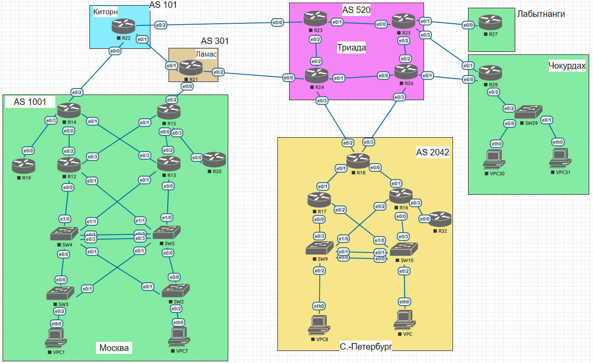

# EIGRP (named EIGRP, default, суммарные префиксы)

## Задание

**Цель:**

- Настроить EIGRP в С.-Петербург
- Использовать named EIGRP

**Описание/Пошаговая инструкция выполнения домашнего задания:**

В офисе С.-Петербург настроить EIGRP:

- R32 получает только маршрут по умолчанию.
- R16-17 анонсируют только суммарные префиксы.
- Использовать EIGRP named-mode для настройки сети.
- Настройка осуществляется одновременно для IPv4 и IPv6.

## Решение

### Базовая настройка

